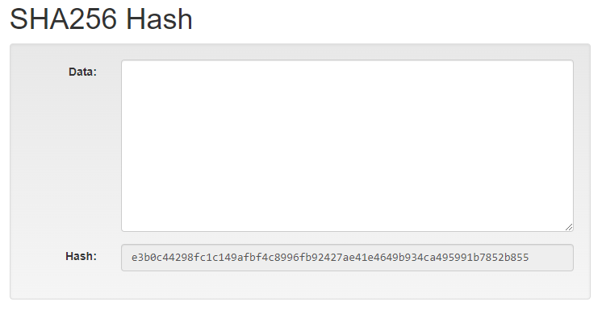
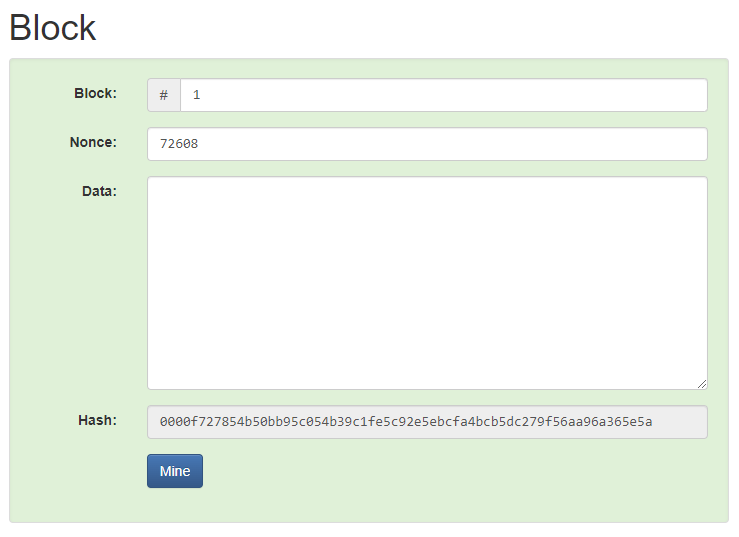
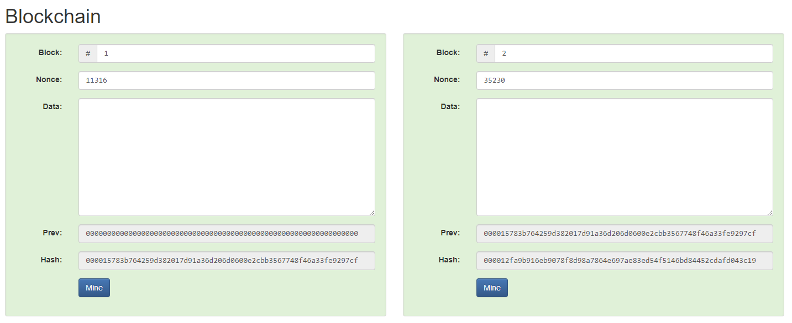
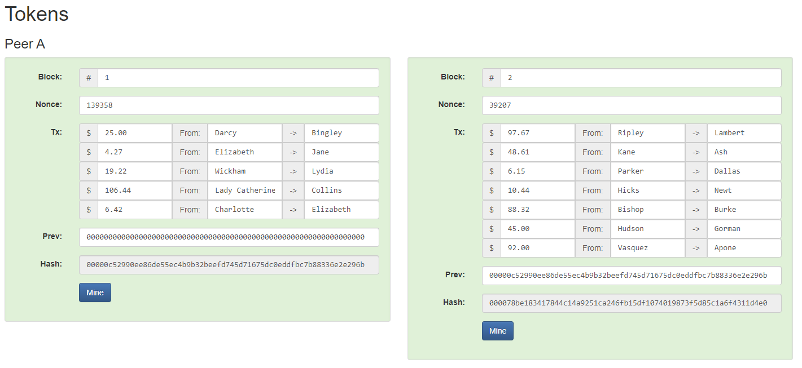
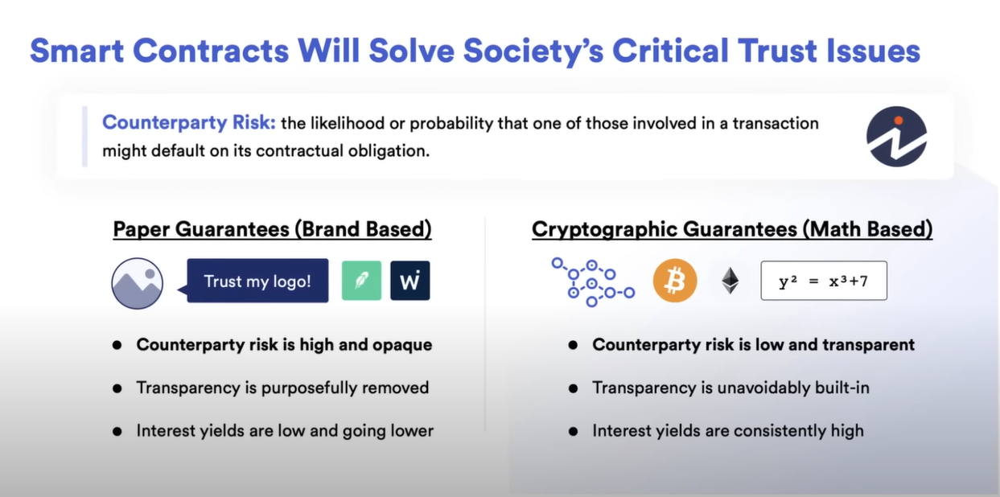
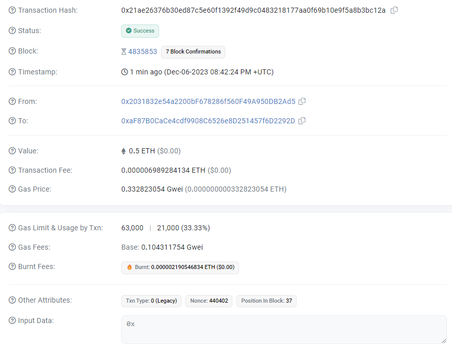

# Web3 Essentials

## Blockchain

- is a public database that is updated and shared across many computers in a network
- consists of consecutive groups of data known as **blocks** that are cryptographically linked together forming a chain
- data in a block is immutable
  - as it cannot be changed without changing all subsequent blocks
  - this requires a consensus from the entire network
- Ethereum uses **proof-of-stake** consensus mechanism where
  - validators stake ETH as collateral to propose and validate blocks

 

    
    <strong>
      Demo Hash
    </strong>

 

 

    
    <strong>
      Demo Block
    </strong>

 

 

    
    <strong>
      Demo Blockchain
    </strong>

 

 

    
    <strong>
      Demo Transaction Blockchain
    </strong>

 

## Bitcoin

- one of the first `protocols` to use the `Blockchain` technology
- [Bitcoin Whitepaper](https://bitcoinwhitepaper.co/) by Satoshi Nakamoto
  - peer to peer transactions in a decentralized network
  - network was powered by cryptography and decentrality
- seen as a superior `digital store` of value or digital gold

## Ethereum

- and other similar Smart Contract platforms take a step further from the Bitcoin platform
- built on the same Blockchain infrastructure with some additional features
- [Ethereum Whitepaper](https://ethereum.org/en/whitepaper/) by Vitalik Buterin
- along with decentralized transactions, other features included:
  - decentralized agreements (Smart Contracts)
  - decentralized organizations
- unlike Bitcoin which was viewed only as a store of value, Ethereum was viewed as both store of value and a utility to facilitate these decentralized agreements

### Ethereum Virtual Machine (EVM)

- is the single canonical computer that exists in the ethereum universe
- it's state is agreed upon by all participants in the network
- users can request the execution of arbitrary computation on the EVM
- such requests are called **transaction requests**
- the requests are stored on the blockchain and cannot be tampered with
- the native cryptocurrency of Ethereum, is used as bounty to incentivize participants to validate and process the requests

## Smart Contracts

- are a set of instructions or reusable snippets of code executed in a decentralized way without the need for a centralized or third party intermediary
- first proposed in early 1990s by Nick Szabo
- exist and executed on the decentralized platforms like Ethereum
- is the factor that differentiates Bitcoin from Ethereum
  - Bitcoin does not have Smart Contracts unlike Ethereum
  - Bitcoin is intentionally "turning incomplete"
- allows the users to build user-facing applications and services on the network

## Oracle Problem

- to convert everyday agreements to digital agreements on blockchains, they need to access the data
- these Blockchains are intentionally walled off and hence cannot read or listen to data from the real world
- `Oracles` solve this problem by interacting with the `off-chain` world to provide external data or computation to Smart Contracts
- a single centralized blockchain oracle or data source cannot be used as it defeats the purpose of blockchain
- to keep the system fully decentralized, a **decentralized** oracle network is needed
- `Chainlink` is a modular, decentralized oracle network that solves the **Oracle Problem**

> This `on-chain` decentralized logic along with the `off-chain` decentralized data/computation gives rise to `Hybrid Smart Contracts`.

## Purpose of Blockchain or Smart Contracts

- [McDonald's scandal](https://www.chicagotribune.com/sns-mcdonalds-story.html)
- relandscape markets and agreements
- makes the agreements unbreakable promises as Smart Contracts are
  - immutable and cannot be altered once deployed
  - decentralized and not limited to a single authority
  - transparent and everyone sees the terms of the agreement
  - impossible to hack, defraud or manipulate
  - executed automatically
- `Smart Contract Value = Trust Minimized Agreements`
  - Moving over from `Brand-based` to `Math-based` agreements

> **Note:**
>
> Any agreement in the history of mankind where there was a trust assumption that was broken, Smart Contracts can and should be applied to.

 

    
    <strong>
        Advantages of Smart Contracts
    </strong>

 

## Other Blockchain Benefits

- Decentralized
- Transparency & Flexibility
- Speed & Efficiency
- Security & Immutability
- Counterparty Risk Removal
- Trust Minimized Agreements

## Smart Contract based Industries

- **DeFi**

  - Decentralized Finance
  - gives users the ability to engage with finance and markets in a decentralized way

- **DAOs**

  - Decentralized Autonomous Organizations
  - are groups that are governed completely decentralized by a set of Smart Contracts on-chain
    - fair and transparent governance & voting

- **NFT**
  - Non-Fungible Tokens
  - digital arts or unique assets

> Note:
>
> - Access to `secret phrase` gives access to all accounts on a wallet
> - Access to a `private key` gives access to a single account

## Transactions

- a **transaction request** is the formal term for a request for code execution on the EVM
- is a fulfilled transaction request and the associated change in the EVM state
- any user can broadcast a transaction request to affect the agreed-upon EVM state
- the transaction request must be validated, executed, and committed to the network by another node for it to affect the agreed-upon state of EVM
- upon committment, the state change is broadcasted to all nodes in the networks
- examples of transactions:
  - Send X ETH from my account to Alice's account.
  - Publish some smart contract code into EVM state.
  - Execute the code of the smart contract at address X in the EVM, with arguments Y.

 

    
    <strong>
        My First SepoliaETH (Testnet) Transaction
    </strong>

 

### Key Terminologies in Transaction Details

- **Transaction Hash**
  - a TxHash or transaction hash is a unique 66-character identifier that is generated whenever a transaction is executed
- **Block**
  - number of the block in which the transaction is recorded
  - block confirmations indicate how many blocks have been added since the transaction was produced
- **From**
  - the sending part of the transaction
- **To**
  - the receiving part of the transaction
  - could be a contract address
- **Value**
  - the value being transacted in Ether and fiat value
- **Transaction Fee**
  - amount paid to process the transaction in native currency, ETH in this case
  - paid by the sender
  - paid to the validators or miner nodes to process the transaction
- **Gas Price**
  - cost per unit of gas spent for the transaction, in Ether and Gwei
- **Gas Limit & Usage by Txn**
  - maximum amount of gas allocated for the transaction and the amount eventually used
  - normal ETH transfers involve 21,000 gas units while contracts involve higher values
- **Gas Fees**
  - base fee refers to the network base fee at the time of the block
  - max fee and max priority fee refer to the max amount a user is willing to pay for their tx and,
  - to give to the block producer respectively
- **Burnt Fees**
  - total amount of ETH burnt from this tx
- **Input Data**
  - additional data included for this transaction
  - commonly used as part of contract interaction or
  - as a message sent to the recipient

> Note: For each transaction, some amount of ether is burnt/lost forever, while some is paid to the miners or validators.

## Gas

- crucial component of the Ethereum network
- serves as the fuel that powers its operations, a computation unit of measurement

### Gas Fees

- is paid for each transaction
- ensures that the network is not vulnerable to spam and infinite computational loops
- must be paid in Etherium's native currency, ether (ETH)
- consists of two components
  - base fee
    - set by the protocol
    - minimum amount that must be paid for a transaction to be considered valid
  - priority fee
    - is a tip that users can add to the base fee
    - incentivizes validators to include theit transaction in the next block
    - offering too little may result in delayed transaction
    - offering too much may waste ETH
- `Gas Fees = Gas Used * Cost per unit Gas`
  - `Gas Fees = Gas Used * (Base Fee + Priority Fee)`

### Gas Limit

- is the maximum amount of gas that a user is willing to consume in a transaction
- higher the complexity of a transaction, like those involving Smart Contracts, higher the required gas limit
- if gas limit too low, the transaction may fail to complete
  - the gas units already consumed will be lost

> Note:
>
> - Gas fees can get high when there is a high demand for transactions on the Ethereum network.
> - Users may need to offer higher tip amounts to outbid other users' transactions to increase the likelihood of their transaction to be processed.
> - Initiatives such as scalability upgrades and layer 2 scaling are being implemented to address gas fee issues.

## Block Reward

- refers to the new digital tokens or cryptocurrencies given to miners who solve a complex math problem and create a new block of verified transactions
- miners use networks of computers to compete with each other in verifying blocks
- in Bitcoin
  - the reward is new BTC (bitcoin) tokens
  - there is a limit on the number of Bitcoins that can be created
  - designed to ultimately have only 21 million bitcoins
    - this is why the reward amount halves approximately every four years after the creation of every 210,000 blocks
  - the reward is expected to reach zero around the year 2140
  - along the way, transaction fees are expected to become the primary incentive for bitcoin miners
- in Ethereum
  - the reward is new ETH (ether) tokens
  - no limit on the number of ether tokens and are created at a faster pace unlike Bitcoin
  - the total number of blocks on the Ethereum chain is larger than in the Bitcoin chain

## Ethereum Improvement Proposal (EIP) 1559

- is a proposed upgrade for the Ethereum blockchain.

### Gas Fee Improvement

- aims to address the issue of unpredictable and high transaction fees on the Ethereum network.
- introduces a new transaction pricing mechanism to make gas fees more predictable and improve the overall user experience.

### Base Fee and Priority Fee

- introduces the concept of a "base fee" that is burned during transactions.
- users can include a "priority fee" to incentivize miners for quicker inclusion in blocks.

### Fee Burn Mechanism

- the base fee is dynamically adjusted based on network demand.
- excess fees (above the base fee) are burned, reducing the overall supply of Ether.

### Predictable Fee Model

- aims to create a more stable and predictable fee model for users and decentralized applications (DApps).

### Implementation Impact

- significant change in Ethereum's economic model.
- expected to mitigate scalability issues and improve the overall efficiency of the network.

### Community Feedback

- EIP 1559 has garnered both support and concerns within the Ethereum community.
- the upgrade represents a fundamental shift in Ethereum's fee structure.

### Activation:

- EIP 1559 was included in the London Hard Fork, which went live on August 5, 2021.
